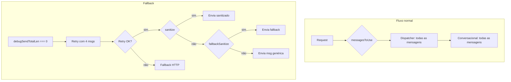

# Diagnóstico: Fallback "não foi processado" e reinício de conversa

## Mapeamento: SSE (Debug) ↔ Logs do backend

### O que o Debug mostra na UI

| Campo | Significado |
|-------|-------------|
| `dispatcher (gpt-4o-mini): X in + Y out` | Tokens do dispatcher (OpenAI) |
| `conversational (modelo do agente): X in + 0 out` | **0 out = modelo não gerou texto** → causa do fallback |
| `Total tokens` | Soma dos dois |

Quando `conversational` mostra **0 output tokens**, o fluxo é:

1. `debugSendTotalLen === 0` no backend
2. Retry é acionado com contexto reduzido (system + últimas 4 mensagens user/assistant)
3. Um dos ramos abaixo ocorre

### Ramos de fallback e logs correspondentes

| Ramo | Condição | Log no backend |
|------|----------|----------------|
| **A** | Retry OK, sanitize retorna texto | `[Chat-Local] Retry OK, enviando conteúdo sanitizado:` |
| **B** | Retry OK, sanitize vazio, fallback tem texto | `[Chat-Local] sanitize retornou vazio, usando fallback:` |
| **C** | Retry OK, sanitize e fallback vazios | `[Chat-Local] sanitize retornou vazio, retryContent preview:` |
| **D** | Retry retorna conteúdo vazio | `[Chat-Local] Retry também retornou vazio, enviando mensagem neutra` |
| **E** | Retry HTTP falha (status != 200) | `[Chat-Local] Retry falhou:` + status + errText |
| **F** | Exceção no retry | `[Chat-Local] Retry error:` |

**Logs de diagnóstico adicionados (2026-03):**

- `[Chat-Local] Resposta vazia do conversacional` — inclui `messagesToUseCount`, `conversationalUserAssistantCount`, `responseConvId`
- `[Chat-Local] Retry usando contexto reduzido` — inclui `retryMessagesCount`, `originalConversationalCount`, `responseConvId`

## Por que a conversa parecia reiniciar

1. **Após o fallback:** a mensagem salva é `"Desculpe, tive um problema ao processar sua mensagem. Pode repetir, por favor?"` — não há perda de `conversation_id`.
2. **Possível causa:** o modelo retornou vazio e o retry usou **apenas 4 mensagens** de contexto. Com isso, o Gemini pode ter "esquecido" o contexto anterior e gerado uma resposta genérica (ex.: saudação + pergunta de nome).
3. **Se o frontend perdeu `conversation_id`:** ao recarregar ou abrir a conversa sem o ID, o backend criaria uma nova conversa e o `load_conversation_messages` retornaria só as mensagens da nova conversa — dando aparência de reinício.

## Histórico de mensagens por fluxo

| Fluxo | Limite | Onde |
|-------|--------|------|
| **Sandbox (chat-local)** | Sem limite | Frontend envia `allMessages` do estado; `load_conversation_messages` retorna todas as mensagens (sem LIMIT no SQL) |
| **Queue (WhatsApp, etc.)** | 60 mensagens | `CHAT_HISTORY_MESSAGE_LIMIT = 60` em `queue.ts` (linhas 27, 407, 883) |
| **Retry (quando resposta vazia)** | 1 system + 12 user/assistant | `chat-local.ts` `RETRY_CONTEXT_MESSAGE_LIMIT = 12` |

### Estabilidade do `conversation_id`

- **Sandbox:** `conversation_id` é enviado no body quando `conversationId` está no estado (definido ao carregar conversa ou ao receber `parsed.conversation_id` no stream).
- **Backend:** usa `conversation_id` do request ou cria nova conversa via `create_conversation` se não houver.
- **Perda de contexto:** se o frontend não enviar `conversation_id` (ex.: nova aba, estado resetado), o backend cria nova conversa e a sessão parece reiniciar.

## Como reproduzir e capturar

1. Ative o sandbox com o agente PPL Motors (ou outro dual-provider).
2. Ative o Debug (botão "Debug").
3. Envie mensagens até o erro.
4. Verifique o terminal do servidor: `[Chat-Local] Resposta vazia`, `[Chat-Local] Retry usando contexto reduzido` e o ramo subsequente (A–F).
5. No Debug da UI, confira `conversational: X in + 0 out` para confirmar.

## Próximos passos

1. Reproduzir e anotar qual ramo (A–F) ocorreu.
2. Se ramo C ou D: avaliar relaxar `sanitizeLLMOutput` ou `fallbackSanitizeForRetry`.
3. Se ramo E: tratar rate limit/timeout com retry com backoff.
4. Se ramo F: investigar exceção específica.
5. Considerar aumentar o contexto do retry (ex.: 8 ou 12 mensagens em vez de 4) para reduzir respostas genéricas após o fallback.
