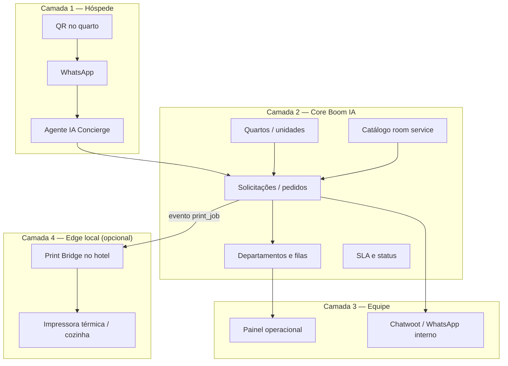

# Hotel Concierge — Concierge Digital por WhatsApp

> **Status:** 📋 Especificação / ideação (não implementado)  
> **Versão do doc:** 1.0  
> **Última atualização:** Junho 2026  
> **Produto:** Boom IA / Nexus AI  
> **Módulo proposto:** `hotel_concierge`

---

## Sumário

1. [Visão e proposta de valor](#1-visão-e-proposta-de-valor)
2. [Problema que resolve](#2-problema-que-resolve)
3. [Posicionamento comercial](#3-posicionamento-comercial)
4. [O que o Boom IA já possui](#4-o-que-o-boom-ia-já-possui)
5. [O que falta construir](#5-o-que-falta-construir)
6. [Arquitetura do módulo](#6-arquitetura-do-módulo)
7. [Modelo de dados](#7-modelo-de-dados)
8. [Fluxos operacionais](#8-fluxos-operacionais)
9. [Integração com agente IA](#9-integração-com-agente-ia)
10. [Print Bridge — impressão local](#10-print-bridge--impressão-local)
11. [Painel administrativo (frontend)](#11-painel-administrativo-frontend)
12. [Backend e estrutura de código](#12-backend-e-estrutura-de-código)
13. [Plano de validação (antes de construir)](#13-plano-de-validação-antes-de-construir)
14. [Roadmap de implementação](#14-roadmap-de-implementação)
15. [Riscos e mitigações](#15-riscos-e-mitigações)
16. [Métricas de sucesso](#16-métricas-de-sucesso)
17. [Referências no repositório](#17-referências-no-repositório)
18. [Próximos passos](#18-próximos-passos)

---

## 1. Visão e proposta de valor

Substituir (ou complementar) o **PABX do quarto** por um **concierge digital via WhatsApp**, permitindo que hóspedes solicitem serviços de quarto, cozinha, governança, manutenção ou recepção de forma **textual, com foto/áudio, rastreável e mensurável**.

O hóspede escaneia um **QR code no quarto** (ou inicia conversa pelo WhatsApp do hotel) e interage com um **agente IA** que:

- Identifica o quarto e o contexto do hóspede
- Classifica a solicitação por departamento
- Cria um **ticket operacional** rastreável
- Notifica a equipe (WhatsApp interno / Chatwoot)
- Opcionalmente **imprime comanda** na cozinha ou governança
- Confirma entrega ao hóspede

A operação do hotel passa a ter **filas por setor, SLA, histórico e relatórios** — algo que o PABX tradicional não oferece nativamente.

---

## 2. Problema que resolve

### Situação atual (PABX)

| Aspecto | Limitação |
|---------|-----------|
| Canal | Apenas voz; sem texto, foto ou cardápio |
| Rastreio | Ligação some após desligar; sem histórico estruturado |
| Roteamento | Recepção centraliza; repasse manual por rádio/anotação |
| Métricas | Sem SLA, volume por tipo ou tempo médio de resolução |
| Custo | Infra PABX, ramais físicos, manutenção |
| Upsell | Difícil apresentar cardápio ou serviços extras |

### Situação desejada (Concierge Digital)

| Aspecto | Benefício |
|---------|-----------|
| Canal | WhatsApp — canal que o hóspede brasileiro já usa |
| Rastreio | Ticket com status, timestamps e auditoria |
| Roteamento | Automático por departamento (cozinha, governança, etc.) |
| Métricas | Dashboard com SLA, picos, demanda por quarto/tipo |
| Custo | Redução de carga na recepção; menos infra física |
| Upsell | Catálogo digital, sugestões contextuais |

### O que o PABX resolve “de graça” (e precisamos replicar)

1. **Identificação do quarto** — no PABX, ramal = quarto
2. **Encaminhamento imediato** — ligação vai para o setor
3. **Accountability operacional** — alguém atendeu (mesmo sem registro formal)

Esses três pontos são **requisitos não negociáveis** do módulo.

---

## 3. Posicionamento comercial

### Como vender (não vender)

| ❌ Evitar | ✅ Preferir |
|----------|------------|
| “Substituir o PABX” (medo de TI/compras) | **Concierge Digital por WhatsApp** |
| “Chatbot genérico” | **Atendimento ao hóspede no quarto com fila operacional** |
| “Automatizar tudo” | **IA + equipe humana com filas e métricas** |

### Proposta de valor por persona

| Persona | Valor |
|---------|-------|
| **Hóspede** | “Escaneie o QR e peça o que precisar — texto, foto, cardápio” |
| **Hotel (gestão)** | Menos ligações na recepção, dados de demanda, upsell |
| **Operação (cozinha/governança)** | Fila clara, comanda impressa (opcional), SLA visível |
| **Recepção** | Menos interrupções; só casos que exigem humano |

### Referência de pricing (mercado BR)

- **R$ 3–8 / quarto / mês** (SaaS recorrente)
- Ou **setup + mensalidade fixa** para hotéis pequenos (30–80 quartos)
- **Setup de Print Bridge** como serviço opcional de implantação

---

## 4. O que o Boom IA já possui

A plataforma **não começa do zero**. Infraestrutura relevante já consolidada:

| Capacidade | Onde no repo | Uso no Concierge |
|------------|--------------|------------------|
| WhatsApp + Chatwoot/WAHA | `server/src/services/delivery.ts`, `waha.ts` | Canal do hóspede |
| Roteamento para times | Tool `chatwoot_assign` em `tool-executor.ts` | Cozinha, governança, manutenção |
| Notificação para equipe | Tool `send_notification`, `utils/sendNotification.ts` | Alerta em grupo WhatsApp interno |
| Módulo de quartos | `hospedagem`, `LodgingRegistryPage.tsx` | Inventário de unidades físicas |
| Catálogo de serviços | `service_catalog` | Cardápio room service, amenities |
| Clientes hotel/resort | Prompts Vale Suíço, Sunset Thermas | Pilotos naturais |
| Multi-tenant + ACL | `tenant_modules`, `ModuleRoute.tsx` | Produto isolado por hotel |
| Galeria de suítes | `suite_galleries` | Fotos de acomodações (vertical resort) |
| Omnibees / hospedagem | `omnibees-availability.ts`, `lodging-consulta.ts` | Reservas (complementar, não core do concierge) |

**Estimativa:** ~60% da infraestrutura conversacional e multi-tenant já existe. O gap principal é a **camada operacional de solicitações in-house** (tickets, filas, SLA, impressão).

---

## 5. O que falta construir

### 5.1 Core operacional

- Entidade **solicitação/pedido** (`hotel_requests`) com ciclo de vida completo
- **Departamentos** configuráveis por hotel (cozinha, governança, manutenção, recepção)
- **Identificação de quarto** (QR, confirmação manual, PMS futuro)
- **Painel Kanban/fila** para equipe operacional
- **SLA** por tipo de solicitação e alertas de atraso

### 5.2 Integrações

- Tool `criar_solicitacao_quarto` no `tool-executor.ts`
- Prompt de agente **concierge in-house** (distinto de vendas/reservas)
- **Print Bridge** — agente edge no hotel para impressoras locais
- (Futuro) Integração **PMS** — vínculo telefone ↔ reserva ↔ quarto no check-in

### 5.3 O que NÃO existe hoje

- Nenhuma integração de **impressora** no codebase
- Nenhum sistema de **tickets/work orders** para operação hoteleira
- Notificações atuais vão apenas para **Chatwoot/WhatsApp**, não para hardware local

---

## 6. Arquitetura do módulo

### 6.1 Quatro camadas

```
┌─────────────────────────────────────────────────────────────────┐
│ CAMADA 1 — HÓSPEDE                                              │
│   QR no quarto → WhatsApp → Agente IA Concierge                  │
└───────────────────────────────┬─────────────────────────────────┘
                                │
┌───────────────────────────────▼─────────────────────────────────┐
│ CAMADA 2 — CORE (Boom IA cloud)                                 │
│   Solicitações │ Departamentos │ SLA │ Catálogo │ Quartos       │
└───────────────────────────────┬─────────────────────────────────┘
                                │
┌───────────────────────────────▼─────────────────────────────────┐
│ CAMADA 3 — EQUIPE                                               │
│   Painel operacional │ Chatwoot/WhatsApp interno │ Tablet cozinha│
└───────────────────────────────┬─────────────────────────────────┘
                                │
┌───────────────────────────────▼─────────────────────────────────┐
│ CAMADA 4 — EDGE LOCAL (opcional por hotel)                      │
│   Print Bridge → Impressora térmica / A4 │ PMS (futuro)         │
└─────────────────────────────────────────────────────────────────┘
```

### 6.2 Diagrama de fluxo de dados



### 6.3 Princípios de design

1. **Ticket-first** — toda solicitação vira registro rastreável, não só conversa
2. **Impressão opcional** — hotel escolhe: só digital, digital + impressão auto, ou manual
3. **Edge local para hardware** — cloud não acessa impressora na LAN do hotel
4. **Reutilizar módulos existentes** — `hospedagem`, `service_catalog`, tools de notificação
5. **Validar antes de construir tudo** — MVP operacional antes de Print Bridge e PMS

---

## 7. Modelo de dados

### 7.1 Entidades principais

#### `hotel_departments`

Departamentos operacionais por tenant.

| Campo | Tipo | Descrição |
|-------|------|-----------|
| `id` | uuid | PK |
| `tenant_id` | uuid | FK tenants |
| `name` | text | Ex.: Cozinha, Governança |
| `slug` | text | `kitchen`, `housekeeping`, `maintenance`, `reception` |
| `chatwoot_team_id` | int? | Time Chatwoot para `chatwoot_assign` |
| `notification_conversation_id` | int? | Grupo WhatsApp interno (`send_notification`) |
| `default_sla_minutes` | int | SLA padrão (ex.: 30 min room service) |
| `enabled` | bool | Ativo/inativo |

#### `hotel_requests`

Coração do módulo — cada pedido do hóspede.

| Campo | Tipo | Descrição |
|-------|------|-----------|
| `id` | uuid | PK |
| `tenant_id` | uuid | FK tenants |
| `request_number` | serial/text | Número legível (#1042) |
| `room_id` | uuid? | FK `lodging_units` |
| `room_number` | text | Ex.: "304" (denormalizado para busca) |
| `guest_phone` | text | Telefone WhatsApp |
| `guest_name` | text? | Nome informado ou CRM |
| `department_id` | uuid | FK `hotel_departments` |
| `type` | enum | `room_service`, `housekeeping`, `maintenance`, `reception`, `other` |
| `status` | enum | Ver ciclo de vida abaixo |
| `priority` | enum | `normal`, `urgent` |
| `items` | jsonb | `[{ catalog_item_id?, name, qty, notes? }]` |
| `free_text` | text? | Descrição livre (ex.: "ar condicionado barulhento") |
| `conversation_id` | uuid? | FK conversas Nexus |
| `assigned_to` | uuid? | Usuário/equipe |
| `sla_deadline_at` | timestamptz | Calculado na criação |
| `acknowledged_at` | timestamptz? | Equipe viu/aceitou |
| `delivered_at` | timestamptz? | Entregue ao hóspede |
| `closed_at` | timestamptz? | Encerrado |
| `created_at` | timestamptz | |
| `metadata` | jsonb | QR source, idioma, etc. |

**Ciclo de vida (`status`):**

```
open → acknowledged → in_progress → delivered → closed
                  ↘ cancelled
```

#### `hotel_printers`

Configuração de impressoras por departamento/local.

| Campo | Tipo | Descrição |
|-------|------|-----------|
| `id` | uuid | PK |
| `tenant_id` | uuid | FK tenants |
| `department_id` | uuid? | FK `hotel_departments` |
| `name` | text | Ex.: "Impressora Cozinha" |
| `bridge_id` | uuid | FK `hotel_print_bridges` |
| `format` | enum | `thermal_80`, `a4` |
| `auto_print_on` | enum | `new_request`, `status_change`, `manual_only` |
| `template_id` | uuid? | Layout da comanda |
| `enabled` | bool | |

#### `hotel_print_bridges`

Agentes edge registrados no hotel.

| Campo | Tipo | Descrição |
|-------|------|-----------|
| `id` | uuid | PK |
| `tenant_id` | uuid | FK tenants |
| `name` | text | Ex.: "Bridge Recepção" |
| `auth_token_hash` | text | Token de autenticação (nunca plain text) |
| `last_seen_at` | timestamptz? | Heartbeat |
| `version` | text? | Versão do agente |
| `enabled` | bool | |

#### `hotel_print_jobs`

Fila de impressão (cloud → edge).

| Campo | Tipo | Descrição |
|-------|------|-----------|
| `id` | uuid | PK |
| `tenant_id` | uuid | FK tenants |
| `request_id` | uuid? | FK `hotel_requests` (se comanda de pedido) |
| `printer_id` | uuid | FK `hotel_printers` |
| `job_type` | enum | `order_ticket`, `housekeeping_ticket`, `shift_report`, `daily_report` |
| `payload` | jsonb | Conteúdo renderizado ou template + vars |
| `status` | enum | `queued`, `sent`, `printed`, `failed`, `expired` |
| `attempts` | int | Retries |
| `error_message` | text? | |
| `printed_at` | timestamptz? | |
| `created_at` | timestamptz | |

#### `hotel_room_qr_codes`

Vínculo QR → quarto (para deep link WhatsApp).

| Campo | Tipo | Descrição |
|-------|------|-----------|
| `id` | uuid | PK |
| `tenant_id` | uuid | FK tenants |
| `room_id` | uuid | FK `lodging_units` |
| `token` | text | Token único na URL |
| `whatsapp_message_template` | text? | Mensagem pré-preenchida |
| `enabled` | bool | |

### 7.2 Reutilização de entidades existentes

| Entidade existente | Uso no Concierge |
|--------------------|------------------|
| `lodging_units` (`hospedagem`) | Quartos físicos |
| `service_catalog` | Itens de room service |
| `conversations` | Vínculo com thread WhatsApp |
| `tenant_modules` | Flag `hotel_concierge` |
| `tools` / `agent_tools` | Tool `hotel_request` |

---

## 8. Fluxos operacionais

### 8.1 Fluxo principal — pedido de room service

```
1. Hóspede escaneia QR do quarto 304
2. Abre WhatsApp com mensagem: "Olá, estou no quarto 304"
3. Agente IA cumprimenta e confirma quarto
4. Hóspede: "Quero 2 águas sem gás e um club sandwich"
5. IA confirma itens e valor (se catálogo tiver preço)
6. Tool criar_solicitacao_quarto:
   - department: cozinha
   - type: room_service
   - items: [...]
   - status: open
7. Paralelo:
   a) send_notification → grupo WhatsApp cozinha
   b) chatwoot_assign → time cozinha (se configurado)
   c) print_job → Print Bridge → impressora cozinha (se habilitado)
8. Equipe aceita no painel → status: acknowledged → in_progress
9. Entrega → status: delivered
10. IA confirma ao hóspede: "Seu pedido foi entregue. Precisa de mais algo?"
11. Encerramento → status: closed
```

### 8.2 Fluxo — governança (toalhas, limpeza)

```
Hóspede: "Preciso de toalhas extras"
→ type: housekeeping
→ department: governança
→ priority: normal (ou urgent se indicado)
→ Comanda térmica na governança (opcional)
→ SLA típico: 15–20 min
```

### 8.3 Fluxo — manutenção

```
Hóspede: "O ar condicionado está fazendo barulho" (+ foto opcional)
→ type: maintenance
→ department: manutenção
→ free_text + anexo da conversa
→ priority: urgent se temperatura/comforto crítico (regras no prompt)
```

### 8.4 Identificação do quarto (estratégias)

| Nível | Método | Quando usar |
|-------|--------|-------------|
| **MVP** | QR code com `room=304` na URL | Piloto; mais confiável |
| **MVP+** | Hóspede informa quarto + sobrenome; IA confirma | Backup se QR falhar |
| **Intermediário** | Link check-in digital com token de estadia | Hotéis com app/check-in online |
| **Ideal** | PMS no check-in vincula telefone ↔ reserva ↔ quarto | Produção escalável |

**Regra de segurança:** pedidos sensíveis (conta, checkout, cobrança) exigem confirmação adicional (sobrenome na reserva ou código da estadia).

### 8.5 Horário noturno

Inspirado no padrão já usado em tenants como PPL Motors:

- **23:30–07:00 (configurável):** room service limitado ao cardápio noturno; manutenção só urgências; governança conforme política do hotel
- Emergências reais → sempre roteia para recepção com `priority: urgent`

---

## 9. Integração com agente IA

### 9.1 Agente separado de vendas

O concierge **in-house** é distinto dos agentes de **reserva/vendas** (Vitória/Vale Suíço, Julia/Sunset):

| Agente vendas | Agente concierge |
|---------------|------------------|
| Lead externo, pré-estadia | Hóspede já hospedado |
| Omnibees, tarifas, qualificação | Pedidos, reclamações, informações |
| Handoff comercial | Handoff operacional |

### 9.2 Tool proposta: `criar_solicitacao_quarto`

Registrada como novo `tool_type`: `hotel_request` (ou similar).

**Entrada (args):**

```json
{
  "room_number": "304",
  "department": "kitchen",
  "type": "room_service",
  "priority": "normal",
  "items": [
    { "name": "Água sem gás", "qty": 2 },
    { "name": "Club sandwich", "qty": 1, "notes": "Sem cebola" }
  ],
  "free_text": null,
  "confirm_with_guest": true
}
```

**Saída (`ToolExecutionResult`):**

```json
{
  "success": true,
  "result": {
    "request_id": "uuid",
    "request_number": "1042",
    "status": "open",
    "sla_deadline_at": "2026-06-06T15:45:00-03:00",
    "estimated_minutes": 30,
    "_hint": "Pedido #1042 registrado. Cozinha notificada. Informe ao hóspede o prazo estimado."
  }
}
```

### 9.3 Outras tools complementares

| Tool | Função |
|------|--------|
| `consultar_catalogo_quarto` | Busca itens do `service_catalog` filtrados por room service |
| `consultar_status_pedido` | Hóspede pergunta "cadê meu pedido?" |
| `chatwoot_assign` | Escalação para humano (recepção) |
| `send_notification` | Já existente — notifica grupo operacional |

### 9.4 Regras críticas no prompt

- Nunca inventar itens ou preços — usar catálogo ou informar indisponibilidade
- Sempre confirmar quarto antes de criar solicitação
- Não citar números de telefone internos (compliance Boom IA)
- Urgência real vs. incômodo menor — classificação correta de `priority`
- Após criar pedido, informar **número do pedido** e **prazo estimado**

---

## 10. Print Bridge — impressão local

### 10.1 Por que não imprimir direto da cloud

O servidor Boom IA roda na **VPS/GHCR** e **não alcança** impressoras na rede local do hotel (firewall, NAT, IP privado). Impressão exige um **agente edge** no local.

### 10.2 Arquitetura Print Bridge

```
┌──────────────────────┐         ┌─────────────────────────────┐
│  Boom IA (cloud)     │         │  Hotel (rede local)          │
│                      │         │                              │
│  hotel_print_jobs    │◄───────►│  Print Bridge                │
│  (fila)              │  WSS /  │  (Raspberry Pi / mini PC)   │
│                      │  poll   │         │                    │
│                      │         │         ▼                    │
│                      │         │  Impressora ESC/POS 80mm     │
│                      │         │  ou impressora A4 rede       │
└──────────────────────┘         └─────────────────────────────┘
```

**Fluxo:**

1. Pedido criado → backend enfileira `print_job` com status `queued`
2. Print Bridge mantém conexão segura (WebSocket ou long polling autenticado)
3. Bridge recebe job, renderiza template, envia para impressora
4. Bridge confirma `printed` ou `failed` → atualiza `hotel_print_jobs`
5. Retry automático (ex.: 3 tentativas) se bridge offline; cache local quando internet cair

### 10.3 Tipos de impressão

| Tipo | Gatilho | Formato | Conteúdo |
|------|---------|---------|----------|
| **Comanda de pedido** | Novo room service | Térmica 80mm | Quarto, itens, hora, observações, #pedido |
| **Ticket governança** | Solicitação housekeeping | Térmica 80mm | Quarto, tipo, urgência |
| **Relatório de turno** | Fim de turno / botão painel | A4 ou térmica | Resumo do período por departamento |
| **Resumo diário** | Cron 06:00 (configurável) | A4 | Volume, SLA, pedidos em aberto |

### 10.4 Opções técnicas de impressora

| Abordagem | Prós | Contras |
|-----------|------|---------|
| **ESC/POS térmica 80mm** | Barata, padrão cozinha, sem driver complexo | Só texto/simples |
| **PrintNode (SaaS)** | Integração rápida | Custo mensal, dependência externa |
| **Bridge próprio (recomendado)** | Controle total, white-label, alinhado ao produto | Dev inicial do agente |
| **E-mail → impressora** | Algumas impressoras aceitam | Lento, pouco confiável |
| **PDF → impressora de rede** | Relatórios A4 | Requer OS/driver no bridge |

**Recomendação:** bridge próprio em Node.js, empacotado como Docker ou binário. Impressoras térmicas ESC/POS (Elgin, Bematech, Epson TM-T20) para comandas de cozinha.

### 10.5 Configuração por hotel (preferência do cliente)

Cada tenant define no painel:

| Modo | Comportamento |
|------|---------------|
| **Só digital** | Painel + WhatsApp; sem impressora |
| **Digital + impressão automática** | Todo pedido novo imprime no departamento |
| **Digital + impressão manual** | Botão "Imprimir" no painel |
| **Relatórios sob demanda** | Export PDF no painel + opção imprimir |

### 10.6 Exemplo de comanda térmica (80mm)

```
================================
     HOTEL EXEMPLO
     COMANDA #1042
================================
Quarto: 304
Hora:   06/06/2026 15:15
Setor:  COZINHA / ROOM SERVICE
--------------------------------
2x  Agua sem gas
1x  Club sandwich
    (sem cebola)
--------------------------------
Obs: Entregar na porta
SLA: 30 min
================================
```

### 10.7 Estrutura do projeto Print Bridge (proposta)

```
print-bridge/
├── src/
│   ├── index.ts           # Loop principal, auth, heartbeat
│   ├── websocket-client.ts
│   ├── escpos.ts          # Driver térmica
│   ├── templates/         # Renderização comanda/relatório
│   └── config.ts
├── docker-compose.yml     # Deploy no mini PC do hotel
├── Dockerfile
└── README.md              # Guia de instalação no hotel
```

### 10.8 Segurança

- Token por bridge, rotacionável no painel
- TLS obrigatório na conexão cloud ↔ edge
- Jobs expiram após N horas se não impressos
- Audit log: quem imprimiu, quando, qual pedido

---

## 11. Painel administrativo (frontend)

### 11.1 Novo módulo: `hotel_concierge`

Registrar em `src/lib/tenant-modules.ts`:

```typescript
{
  key: "hotel_concierge",
  label: "Concierge",
  description: "Atendimento ao hóspede no quarto — pedidos, filas e impressão.",
  group: "overview",
  actions: [view, create, edit, delete, export],
}
```

Rotas protegidas via `ModuleRoute moduleKey="hotel_concierge"`.

### 11.2 Telas propostas

| Tela | Rota sugerida | Função |
|------|---------------|--------|
| **Board de solicitações** | `/concierge` | Kanban/lista por departamento e status |
| **Detalhe do pedido** | `/concierge/:id` | Itens, quarto, SLA, histórico, ações |
| **Departamentos** | `/concierge/departments` | CRUD + vínculo Chatwoot/grupo WhatsApp |
| **Impressoras** | `/concierge/printers` | CRUD + bridge + templates |
| **QR Codes** | `/concierge/qr-codes` | Gerar/baixar QR por quarto |
| **Relatórios** | `/concierge/reports` | Volume, SLA, export CSV/PDF |

### 11.3 UX operacional (cozinha/governança)

- Vista **full-screen** para tablet na cozinha (modo kiosk)
- Som/browser notification em novo pedido (opcional)
- Ações em 1 clique: Aceitar → Em andamento → Entregue
- Badge de SLA verde/amarelo/vermelho
- Filtro por departamento conforme permissão do usuário

---

## 12. Backend e estrutura de código

### 12.1 Arquivos propostos

```
server/src/
├── routes/hotel-concierge.ts       # REST: requests, departments, printers, reports
├── services/
│   ├── hotel-request.ts            # CRUD + roteamento + SLA
│   ├── hotel-print-queue.ts        # Enfileiramento de jobs
│   └── hotel-print-bridge.ts       # Protocolo WebSocket com edge
├── workers/hotel-print-worker.ts   # Retry, dead letter
└── services/tool-executor.ts       # + case hotel_request

src/
├── pages/hotel-concierge/
│   ├── RequestsBoardPage.tsx
│   ├── RequestDetailPage.tsx
│   ├── DepartmentsPage.tsx
│   ├── PrintersPage.tsx
│   ├── QrCodesPage.tsx
│   └── ReportsPage.tsx
└── hooks/useHotelConcierge.ts

sql/
├── 0xx_hotel_concierge_schema.sql
└── 0xx_register_hotel_request_tool.sql

docs/
└── HOTEL-CONCIERGE.md              # Este documento
```

### 12.2 Endpoints REST (proposta)

| Método | Rota | Descrição |
|--------|------|-----------|
| GET | `/hotel-concierge/requests` | Lista com filtros (status, dept, room) |
| POST | `/hotel-concierge/requests` | Cria solicitação (tool ou painel) |
| PATCH | `/hotel-concierge/requests/:id` | Atualiza status, assignee |
| GET | `/hotel-concierge/departments` | Lista departamentos |
| POST/PATCH | `/hotel-concierge/departments` | CRUD departamentos |
| GET | `/hotel-concierge/printers` | Lista impressoras |
| POST | `/hotel-concierge/print-jobs/:id/retry` | Reimprimir |
| GET | `/hotel-concierge/reports/summary` | Métricas agregadas |
| WS | `/hotel-concierge/bridge/connect` | Print Bridge |

### 12.3 Eventos internos (após criar solicitação)

```
hotel.request.created
  → notify_department (send_notification)
  → assign_chatwoot (chatwoot_assign, se configurado)
  → enqueue_print (se auto_print_on = new_request)
  → update_sla_timer
```

---

## 13. Plano de validação (antes de construir)

> **Regra:** validar modelo operacional em semanas, não meses de desenvolvimento.

### Fase 0 — Descoberta (1–2 semanas, R$ 0 de dev)

**Objetivo:** confirmar dor e disposição a pagar.

Entrevistar **3–5 hotéis** (ideal: 1 cliente Boom IA atual — Vale Suíço, Sunset Thermas ou pousada parceira).

**Perguntas-chave:**

- Quantas ligações PABX/dia por tipo (room service, governança, recepção)?
- Tempo médio de atendimento e resolução?
- Quem atende hoje? Recepção centraliza tudo?
- Já usam WhatsApp informalmente com hóspedes?
- Pagariam por isso? Quanto? (por quarto/mês ou fee fixo)
- Usam impressora térmica na cozinha hoje? Querem manter?

**Critério de go:** ≥ 2 hotéis dizem “eu pagaria se resolvesse X” com número concreto.

### Fase 1 — Concierge MVP (2–3 semanas, reutilizando stack atual)

**Objetivo:** provar fluxo operacional sem módulo novo.

| Item | Como |
|------|------|
| QR code | 5–10 quartos em 1 hotel piloto |
| Agente | Prompt concierge + tools existentes |
| Roteamento | `chatwoot_assign` + `send_notification` |
| Rastreio | Planilha ou labels Chatwoot (manual) |
| Catálogo | `service_catalog` se existir |

**Métricas (30 dias):**

| Métrica | Meta indicativa |
|---------|-----------------|
| Solicitações via WhatsApp vs PABX | Tendência de substituição |
| Tempo até 1ª resposta | < 2 min (IA) |
| Tempo até resolução | Comparar com baseline PABX |
| Taxa de conclusão | ≥ 70% sem ligação |
| Erros de quarto errado | < 5% |
| NPS hóspede | ≥ 8 |

**Critério de go:** ≥ 70% resolvidas sem PABX + NPS ≥ 8 + hotel quer continuar.

### Fase 2 — Piloto estruturado (4–6 semanas)

Construir **M1 Core** (solicitações, departamentos, painel, QR) em 1 hotel pagante ou com LOI (carta de intenção).

### Fase 3 — Produto comercial

M3 Print Bridge + pricing + onboarding documentado.

---

## 14. Roadmap de implementação

| Fase | Escopo | Impressão | Prazo indicativo |
|------|--------|-----------|------------------|
| **M1 — Core** | Solicitações, departamentos, painel, QR, tool IA | Export PDF no painel | 4–6 sem |
| **M2 — Notificações** | WhatsApp equipe, SLA, alertas, métricas | — | 2–3 sem |
| **M3 — Print Bridge v1** | Agente edge + comanda térmica automática | Auto por departamento | 4–6 sem |
| **M4 — Relatórios** | Turno, diário, export | Impressão sob demanda | 2–3 sem |
| **M5 — PMS** | Check-in vincula telefone ↔ quarto | — | TBD |

**Dependências:**

```
Fase 0 (descoberta) → Fase 1 (MVP manual) → M1 → M2 → M3 → M4 → M5
                              ↓
                    Só avançar se validado
```

---

## 15. Riscos e mitigações

| Risco | Impacto | Mitigação |
|-------|---------|-----------|
| Hóspede não escaneia QR | Baixa adoção | QR visível + mensagem check-in + cartão no quarto |
| Quarto identificado errado | Pedido no quarto vizinho | QR + confirmação sobrenome; pedidos sensíveis exigem código estadia |
| Recepção resiste | Sabotagem interna | Mostrar redução de ligações na Fase 1; envolver gerente operacional |
| Horário noturno | Expectativa 24h | Cardápio/regras noturnas configuráveis; urgências sempre passam |
| WhatsApp bloqueio/spam | Canal indisponível | Número dedicado hotel; templates; volume controlado |
| Internet do hotel cai | Pedidos não chegam | Bridge cacheia jobs; fallback WhatsApp direto equipe |
| Impressora offline | Cozinha sem comanda | Painel + notificação WhatsApp como canal primário; print é complemento |
| IA classifica errado | Pedido no setor errado | Humano reatribui no painel; métricas de acerto por tipo |
| Escopo creep | Atraso | M1 sem PMS, sem pagamento na conta, sem multi-idioma |

---

## 16. Métricas de sucesso

### Operacionais (hotel)

- Volume de solicitações por tipo/dia/turno
- Tempo médio: criação → acknowledged → delivered
- % dentro do SLA
- Taxa de cancelamento
- Pedidos por quarto ocupado

### Produto (Boom IA)

- Hotéis ativos no módulo
- Quartos com QR ativo
- Print jobs success rate
- Uptime Print Bridge
- Churn / expansão (quartos adicionais)

### Comerciais

- CAC payback
- MRR por quarto
- Upsell room service (comparar antes/depois se dados disponíveis)

---

## 17. Referências no repositório

| Tema | Arquivo |
|------|---------|
| Módulos tenant | `src/lib/tenant-modules.ts` |
| Quartos/unidades | `src/pages/hospedagem/LodgingRegistryPage.tsx` |
| Tool executor | `server/src/services/tool-executor.ts` |
| Notificações | `server/src/utils/sendNotification.ts` |
| Delivery WhatsApp | `server/src/services/delivery.ts` |
| Hospedagem (vertical resort) | `docs/HOSPEDAGEM_INDEX.md` |
| Omnibees (reservas) | `server/src/services/omnibees-availability.ts` |
| Prompts hotel existentes | `server/src/services/prompts/vale-suico.ts`, `sunset-thermas.ts` |
| Catálogo | módulo `service_catalog` |
| ACL rotas | `src/components/ModuleRoute.tsx` |

---

## 18. Próximos passos

### Imediato (produto)

- [ ] Agendar 3 entrevistas com hotéis (1 cliente Boom IA)
- [ ] Definir hotel piloto para Fase 1
- [ ] Esboçar prompt concierge (distinto de vendas)
- [ ] Gerar QR codes teste para 5 quartos

### Imediato (técnico — após validação Fase 1)

- [ ] Migration SQL: `hotel_departments`, `hotel_requests`
- [ ] Route `hotel-concierge.ts` + hook frontend
- [ ] Tool type `hotel_request` no tool-executor
- [ ] Registrar `hotel_concierge` em `tenant-modules.ts`
- [ ] Testes Vitest: criação pedido, SLA, roteamento

### Médio prazo

- [ ] Print Bridge POC com 1 impressora térmica
- [ ] Doc de instalação edge (`print-bridge/README.md`)
- [ ] Spec E2E concierge (padrão `docs/E2E-*.md`)

---

## Apêndice A — Glossário

| Termo | Definição |
|-------|-----------|
| **Concierge** | Atendimento ao hóspede durante a estadia |
| **Print Bridge** | Agente software no hotel que conecta cloud ↔ impressora local |
| **Room service** | Pedido de alimentos/bebidas ao quarto |
| **Housekeeping** | Governança — toalhas, limpeza, amenities |
| **PMS** | Property Management System — sistema hoteleiro de reservas/check-in |
| **ESC/POS** | Protocolo padrão de impressoras térmicas |
| **SLA** | Tempo máximo acordado para atender/entregar |

## Apêndice B — Diferença vs. módulo Hospedagem existente

| | **Hospedagem** (atual) | **Hotel Concierge** (proposto) |
|--|------------------------|----------------------------------|
| **Foco** | Reservas, tarifas, calendário parque | Pedidos in-house durante estadia |
| **Usuário** | Lead / futuro hóspede | Hóspede já no quarto |
| **Tools** | `lodging_consulta`, Omnibees | `hotel_request`, catálogo, print |
| **Painel** | Estoque quartos, precificação | Fila operacional, SLA, comandas |
| **Complementar** | Sim — mesmo tenant pode usar ambos | |

---

**Documento mantido em:** `docs/HOTEL-CONCIERGE.md`  
**Contato interno:** time Boom IA / produto  
**Licença de uso:** documentação interna do repositório
